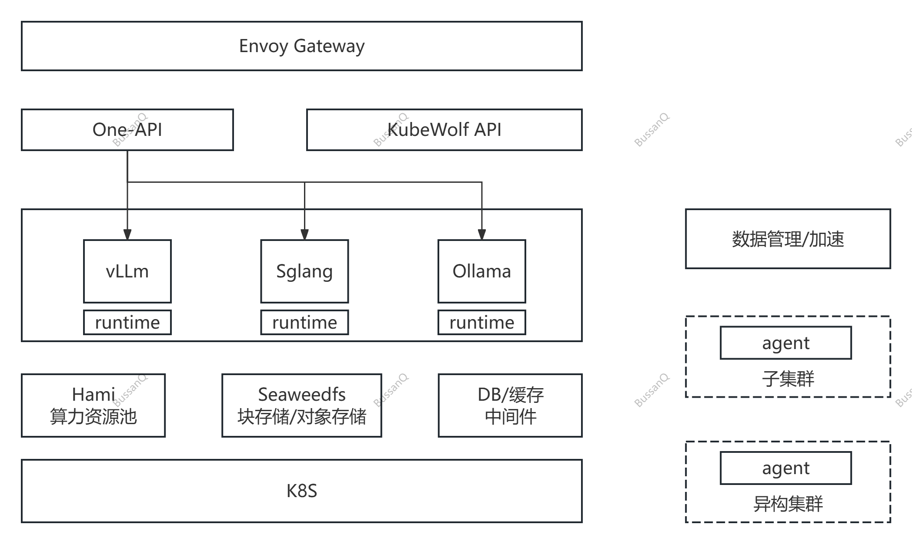

# kubewolf
## AI Infra / Model Platform
一个高效易用、现代化、高性能的AI大模型平台，基于开源生态构建的完整解决方案，支持一体机/集群、纯离线部署，前置准备只需要最小化安装的操作系统及GPU驱动。

## 特性
- 离线环境/私有云一键部署
- 算力调度、虚拟化，支持国产异构芯片
- 高性能分布式存储
- 高性能Envoy网关

## Supported Accelerators

- [x] NVIDIA CUDA
- [x] Ascend CANN
- [x] Hygon DTK

## 感谢
- [Sealos](https://github.com/labring/sealos)
- [Hami](https://github.com/Project-HAMi/HAMi)
- [Seaweedfs](https://github.com/seaweedfs/seaweedfs)
- [Envoy Gateway](https://github.com/envoyproxy/gateway)
- [One-Api](https://github.com/songquanpeng/one-api)
- [Jfinal](https://github.com/jfinal/jfinal)
- [Pear-Admin](https://gitee.com/pear-admin/Pear-Admin-Layui)