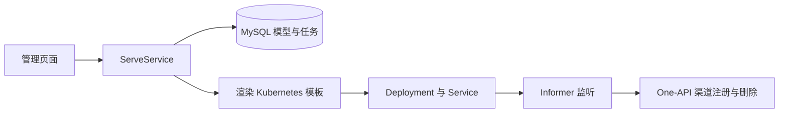

# 项目分析与修复建议

分析日期：2026-09-19

## 总体判断

当前项目是一个基于 Kubernetes 的大模型部署与管理平台原型。核心代码围绕模型管理、推理服务部署和网关注册展开，分层比较清楚，但前后端接口、部署配置和资源生命周期还存在断点，尚不足以支撑 README 描述的完整平台能力。

本文基于当前仓库源码的静态分析。除本文档外，未修改业务代码，也未进行集群联调。

## 技术栈与结构

| 层次 | 实现 | 作用 |
| --- | --- | --- |
| Web 后端 | Java 23、Spring Boot 3.3.5、Undertow | 页面路由与 REST API |
| 前端 | JFinal Enjoy 模板、Layui、Pear Admin、jQuery | 服务端渲染的管理界面 |
| 数据持久化 | MySQL、JFinal ActiveRecord、HikariCP | 模型模板和服务任务 |
| 集群操作 | Fabric8 Kubernetes Client | 创建、删除、监听 Kubernetes 资源 |
| 推理接入 | vLLM、SGLang 配置；One-API 接口 | 启动推理容器、注册模型渠道 |
| 基础设施安装 | Sealos 脚本 | 安装 Kubernetes、HAMi、SeaweedFS、Envoy Gateway |

仓库约有 2,881 行 Java 代码，属于单体应用。主要目录职责如下：

- `src/main/java/com/bussanq/kubewolf/api`：接口、业务服务和数据库模型。
- `src/main/java/com/bussanq/kubewolf/ai`：推理服务抽象、Kubernetes 实现及资源事件监听。
- `src/main/java/com/bussanq/kubewolf/common`：数据库、HTTP、Kubernetes 通用封装。
- `src/main/java/com/bussanq/kubewolf/web`：页面控制器、模板配置和返回值。
- `src/main/resources/k8s`：Deployment、Service 等资源模板。
- `scripts`、`sealosbuild`：基础设施安装与部署材料。

## 核心业务流程

部署模型时，`ServeService.startModel()` 读取模型模板，补充框架镜像、启动命令和端口，保存任务，再提交 Kubernetes 资源。列表接口将数据库记录与 Informer 缓存中的 Deployment 状态合并。

业务编排、集群操作和网关接入已有基本分层，可以围绕现有结构补齐功能。但接口返回部署成功目前只表示资源提交成功，并不代表模型已经就绪、能够推理。

## 实际完成度

| 功能 | 当前状态 |
| --- | --- |
| 模型管理 | 后端 CRUD 已有，前端接口和字段存在不一致 |
| 推理服务 | 已有创建、启动、停止、列表和删除代码，生命周期处理不完整 |
| 框架支持 | vLLM 配置较完整；SGLang 有明确缺陷；页面提供的 Ollama 未实现 |
| 训练任务 | 页面存在，后端 `/api/v1/train/list` 只返回空成功结果 |
| 监控首页 | 节点数、CPU、内存等数据为硬编码 |
| 存储、镜像管理 | 菜单复用了其他页面，未看到独立管理实现 |
| 异构 GPU | 有外部基础设施集成意图，仓库内不足以验证 README 的全部支持声明 |

## 优先修复的问题

### 1. 模型管理的前后端契约不一致

新增页面请求 `/api/v1/model/save`，后端实际提供 `/api/v1/models/create`；表单的 `modelName` 与实体的 `name` 也不一致。删除页面发送 JSON `modelId`，后端却接收普通参数 `String id`，且页面读取的 `obj.data['modelId']` 与模型记录的 `id` 字段不一致。这些问题会直接阻断模型管理流程。

相关文件：

- [模型新增页面](../src/main/resources/templates/aiplatform/model/add.html)
- [模型列表页面](../src/main/resources/templates/aiplatform/model/main.html)
- [ModelC.java](../src/main/java/com/bussanq/kubewolf/api/controller/ModelC.java)
- [BaseModelTpl.java](../src/main/java/com/bussanq/kubewolf/api/model/base/BaseModelTpl.java)

修复建议：统一接口路径、请求方式和字段命名，明确模型创建与删除的请求结构，并同步调整页面。

### 2. 推理框架选择存在逻辑错误

`sglang` 分支构建对象后缺少 `return`，最终返回空配置；前端可选 `ollama`，后端没有对应分支。未知框架也直接返回空对象，错误会拖到部署阶段才暴露。

相关文件：[FrameWorkService.java](../src/main/java/com/bussanq/kubewolf/api/service/FrameWorkService.java)。

修复建议：补齐 SGLang 返回值；实现 Ollama 或移除尚未支持的选项；对空值和未知框架明确返回参数错误。

### 3. 模型部署参数没有完整传递

- 模型选择列表使用硬编码 ID，没有从模型接口加载。
- 页面提供“实例数量”，但 `ServeTaskReq` 没有 `replicas` 字段，部署最终使用默认值 1。
- 框架命令使用模型名 `qwen`，Kubernetes 注解却写死 `qwen2.5:0.5b`，网关会据此生成不一致的模型映射。

相关文件：

- [服务新增页面](../src/main/resources/templates/aiplatform/serve/add.html)
- [ServeTaskReq.java](../src/main/java/com/bussanq/kubewolf/web/model/vo/ServeTaskReq.java)
- [ServeService.java](../src/main/java/com/bussanq/kubewolf/api/service/ServeService.java)
- [FrameWorkService.java](../src/main/java/com/bussanq/kubewolf/api/service/FrameWorkService.java)
- [Kubernetes 部署模板](../src/main/resources/k8s/ServeTask)

修复建议：动态加载模型列表，完整传递并校验副本数，统一推理引擎的模型名与网关映射配置。

### 4. 服务删除与部署失败缺少生命周期处理

`ServeService.delete()` 只删除数据库记录，没有清理 Deployment、Service 或网关渠道。直接删除运行中的服务，会留下继续占用资源、但无法从任务列表管理的实例。

另外，创建流程先落库再部署，失败后没有明确的失败状态或补偿机制。

相关文件：[ServeService.java](../src/main/java/com/bussanq/kubewolf/api/service/ServeService.java)。

修复建议：定义创建、就绪、失败、停止和删除状态；删除流程应完成资源清理并处理失败重试；部署失败需要保留可诊断、可重试的状态。

### 5. 网关同步缺少结果校验和失败恢复

创建渠道后，无论响应内容是否表示成功，都会将 Deployment 标记为已注册；`onUpdate()` 为空，没有看到补偿重试逻辑。网关短暂不可用时，可能形成“服务已部署，但渠道不存在”的长期不一致。

相关文件：

- [K8sOperator.java](../src/main/java/com/bussanq/kubewolf/ai/k8s/K8sOperator.java)
- [GatewayService.java](../src/main/java/com/bussanq/kubewolf/api/service/GatewayService.java)
- [HttpKit.java](../src/main/java/com/bussanq/kubewolf/common/utils/HttpKit.java)

修复建议：检查 HTTP 状态和业务响应，仅在确认成功后更新注册标记；补充幂等注册、删除和失败重试机制。

### 6. 应用层认证与授权尚未实现

仓库内未见安全过滤器、鉴权拦截器或权限检查；登录页发送 POST `/login`，后端只有 GET 页面路由。若没有外部访问控制，能访问管理 API 的调用方即可执行服务管理操作。

相关文件：

- [登录页面](../src/main/resources/templates/login.html)
- [WebC.java](../src/main/java/com/bussanq/kubewolf/web/controller/WebC.java)
- [ServingC.java](../src/main/java/com/bussanq/kubewolf/api/controller/ServingC.java)

修复建议：在对外开放管理入口前，补齐登录会话、接口鉴权和操作权限控制。

## 部署与工程化缺口

目前仓库还不能独立复现完整运行环境：

1. 没有找到 `model_tpl`、`serve_task` 的建表或数据库迁移脚本。
2. 默认 kubeconfig 指向 Windows 本地路径；读取失败只记录日志，后续初始化监听器仍会访问空客户端。
3. Kubernetes 模板默认使用 `default` 命名空间，监听器使用配置中的命名空间，修改配置后可能出现部署与监听不一致。
4. 应用默认连接 `gateway-one:3000`，部署清单创建的是 `aiproxy` Service，需要统一配置并验证接口兼容性。
5. 安装脚本主要覆盖基础设施，未包含 Java 应用、数据库和模型 PVC 的完整部署链路。
6. 未发现测试目录、CI 配置或 Maven Wrapper。

相关文件：

- [application.yaml](../src/main/resources/application.yaml)
- [K8sService.java](../src/main/java/com/bussanq/kubewolf/common/k8s/lib/K8sService.java)
- [数据库映射](../src/main/java/com/bussanq/kubewolf/api/model/dto/_MappingKit.java)
- [安装脚本](../scripts/install.sh)
- [AI 代理部署清单](../sealosbuild/kubewolf/manifests/aiproxy.yaml)

## 建议实施顺序

1. **打通基本流程**：补齐数据库初始化和本地配置，修复模型管理接口、框架选择、部署参数和模型名映射。
2. **保证生命周期完整**：处理部署失败、就绪状态、停止、资源删除和网关同步重试。
3. **补齐访问控制与交付材料**：完成认证授权、应用部署清单及可复现的安装说明。认证授权应在对外开放管理入口前完成。
4. **扩展平台能力**：接入真实监控数据，再逐步完成训练、存储、镜像及异构 GPU 管理。

优先验证一条最小闭环：

> 创建模型 → 部署 vLLM → 等待就绪 → 通过网关推理 → 停止或删除 → 确认 Kubernetes 资源和网关渠道均已清理。

开发验证只做受影响模块的必要测试，不做全量测试。建议覆盖框架配置返回值、模型接口契约、部署参数传递和资源清理的失败分支。

## 本次验证范围

- 已阅读主要业务代码、页面、配置和部署模板，并核对关键调用链。
- 当前终端未找到 Maven，`java -version` 提示没有可用 Java Runtime。
- 未执行编译、测试或集群联调；运行结果及外部组件兼容性仍需在具备依赖的环境中验证。
- 未提交 Git commit。
